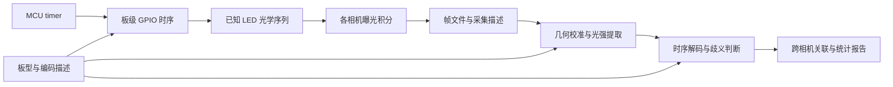

# 总体方案

状态：2026-09-04 初步设计。工程边界与目录采用本文；编码和性能指标仍需实际采集验证。

## 1. 建议与适用边界

采用一个独立仓库，包含固件、板型描述和离线分析工具。UNO R4 WiFi 满足单板、USB 供电、无需 PCB/焊接的首版目标；它适合做光学时间参考原型，但现有证据不足以承诺 100 µs 实测精度。

第一版覆盖静止标靶、固定机位、多相机共同看到同一块板的采集。多节点是相机按采集节点分组，而不是各节点使用独立自由运行的 LED 板。无法共视时，需要独立的跨板同步或桥接观测设计，暂不纳入首版。

工具测量的是**实际曝光时间关系**。它不能仅凭照片分离节点操作系统时钟误差、传输延迟和相机内部延迟；报告中的 node offset 是指定代表相机或明确聚合后的光学偏差。

## 2. 从光学参考到报告



固件不依赖主机及时发命令。串口只承担配置、启动/停止及运行描述导出；USB 命令到达时间不定义曝光真值。每次运行记录 run ID，复位后重新开始并分段处理。

## 3. 固件与编码路线

### 3.1 可解释的时序链

优先实现 GPT 周期事件 → 短 ISR → 预计算的 GPIO source/sink 操作。Arduino framework 提供板级启动与上传支持，关键路径使用经核对的 FSP / 寄存器操作。timer 通道、时钟源、分频、计数周期、中断优先级、blanking 时间均写入运行描述。

这仍包含中断响应延迟，不等于 timer 直接硬件输出。DTC/DMAC/事件链仅作为未来专项优化：必须先核对多端口写入、方向切换与触发机制，不能预先承诺任意 LED 的零抖动切换。

每个时隙最多点亮一颗 LED，切换前先关闭上一颗并使无关脚保持高阻。光学模型包含实际导通时间和短暂 blanking。停止、异常和启动过程具有明确的非测量状态。

官方 10 kHz 驱动每次中断扫描一颗 LED，96 颗一轮约为 9.6 ms；因此不使用动画 framebuffer 作为同时更新的 96 bit 时间码。依据见[硬件核对](hardware/uno-r4-wifi.md)。

### 3.2 两级推进，不提前冻结难以解码的协议

| 阶段 | 编码候选 | 可以获得的结果 | 限制 |
| --- | --- | --- | --- |
| v0 可读性原型 | 固定顺序扫描 96 颗，初始 250 µs/slot，候选 100 µs/slot | 单帧曝光覆盖的扫描位置、周期内相位差、质量诊断 | 周期为 24 ms / 9.6 ms，无法独立区分整周期偏差 |
| v1 正式测量候选 | 有明确生成规则和长周期的单灯位置序列，联合连续多帧解码 | 有条件地恢复共享 epoch、帧对应关系、完整 offset | 曝光积分会丢失槽位顺序；长周期本身不保证可辨识 |

v0 的输出只能标为周期内相位或候选集合。不能将其用于证明没有整帧错位：例如 100 µs 模式中的 0.2 ms 与 9.8 ms 偏差可能同相位。

v1 在实现前必须确定序列生成规则、种子/初态、周期、起始标识、观测窗口与搜索范围。候选方案是受约束的伪随机单灯序列，控制各灯占空比并延长重复周期；不在初始化时指定未经论证的 LFSR 多项式。需要证明/验证所需曝光范围内积分向量及多帧组合足以排除候选别名。若不满足，先修改协议设计，不在 CV 端猜测。

长曝光不是单纯的噪声问题：覆盖完整重复周期时相位信息可能消失。短曝光也可能只看到一颗灯，无法定位其时隙内位置。初期应固定曝光和增益，选择能看到若干时隙、又保留边界信息的曝光设置；具体范围由首批相机和光学可读性决定。

## 4. CV 模块

采用 Python 3.11+、NumPy、OpenCV headless 和 tqdm。CLI 使用标准库 argparse；配置与机器结果优先 JSON，减少额外依赖。输入是用户提供的一批图像：支持单相机图像序列及通过显式 crop 描述的拼接图，不集成采集 SDK、相机控制或其它采集仓库。视频容器读取仅在后续有明确需求时另议。

处理步骤：

1. 读入采集 manifest，检查 camera/node ID、帧列表、曝光参数与板型/编码版本。
2. 用单独的慢速定位序列获得完整网格；首版允许显式提供四角和方向，生成几何校准文件。不要假设高速单帧总能看到四角。
3. 根据平面映射采样每颗 LED；保留原图中的传感器行坐标。明显镜头畸变需要已有相机内参进行校正。
4. 从暗背景与慢速点亮采集估计背景、各灯响应和噪声，提取非饱和光强。不能只用统一阈值把部分曝光变成二值。
5. 按曝光积分模型估计起点/中点、可行时间区间或多个候选；记录残差、歧义与拒绝原因。
6. 基于独立光学时间和明确的帧对应约束进行单调关联，输出匹配/未匹配帧；不得靠最近时间匹配掩盖整帧错位。
7. 汇总相机对、节点对、时间序列及质量报告，流式写出逐帧结果并展示进度。

模块按实现需要依次加入 `io`、`geometry`、`photometry`、`decode`、`metrics`、`report`、`cli`；不预先创建空接口层或插件发现框架。第一块板先直接按 board ID 选择实现，第二块板出现时再抽象真实公共部分。

## 5. 曝光模型与 rolling shutter

对 global shutter 的第 j 颗 LED，初步模型为：

```text
I_j = background_j + gain_j * integral(L_j(t), t_start, t_start + exposure) + noise_j
```

`L_j(t)` 由编码序列和板级导通窗口定义。优先使用已知曝光时间；仅在数据可辨识时联合估计曝光，并单独报告不确定度。亮度模型要求未饱和、响应已校准；相机 ISP、gamma 和压缩会影响这一前提。

rolling shutter 各行曝光起点不同，不能把整个矩阵作为同一瞬间。第一版正式量化优先支持 global shutter；rolling shutter 可先做诊断，只有已知/已标定行时延和扫描方向时才输出校正的定量结果。模型使用原始传感器坐标、ROI 偏移和参考行：

```text
t_start(y) = t_start(y_ref) + (y - y_ref) * line_time
```

图像旋转、裁剪和 resize 必须保留到传感器坐标的映射。若读出沿列方向，模型对应改用列坐标。原理依据：[Basler Electronic Shutter Types](https://docs.baslerweb.com/electronic-shutter-types)。

## 6. 指标与判定

默认报告曝光中点；需要曝光起点时显式指定。对于匹配帧，`delta_ab = t_b - t_a`，正值表示 B 比 A 晚。

- **Offset**：相机对偏差的中位数，同时保留逐帧 delta。
- **Jitter**：delta 减去中位数后的样本标准差、绝对残差 P95、峰峰值及有效样本数。样本不足不输出虚假标准差。
- **Drift**：另行拟合偏差随光学时间的斜率；去趋势后的 jitter 另列，不能替换原始统计。
- **Frame consistency**：逐相机光学帧间隔、相对指定预期间隔的残差、缺失/重复/未匹配候选和异常区段。不以文件序号代替硬件帧计数。
- **Node offset**：先报告跨节点相机对；节点摘要默认使用 manifest 指定的代表相机。只有各相机间固定偏差和采集对应关系明确时才做聚合，并标明方法。

报告区分 `pass`、`fail`、`inconclusive`。阈值由用户显式配置，250 µs 时隙不是默认通过阈值。仅在覆盖率、观测窗口和不确定度满足要求时判定；周期歧义或未知 rolling shutter 参数不得判为 pass。

## 7. 精度证据与实施阶段

时间量先保留 MCU ticks 和名义微秒换算；未标定振荡器时明确使用名义时钟尺度。硬件计时周期、ISR 延迟、光学导通、成像响应、解码误差是不同误差源。仅凭同一个 MCU 的内部计时或相机间一致性，不能证明外部可追溯的绝对 100 µs 准确度。

基础使用不要求示波器或光电二极管。如果后续需要对外宣称经标定的绝对精度，可单独安排外部校准；没有这项证据时报告为未标定原型及观测到的重复性。下面的验证是未来工作计划，执行遵守用户对科研测试的授权要求。

| 阶段 | 交付 | 进入下一阶段的依据 |
| --- | --- | --- |
| M0（本次） | 方案、约定、工程布局和配置骨架 | 文档可追溯、无未声明的功能 |
| M1 | 单灯定位/慢扫模式、250 µs 定时扫描、运行描述 | 实际相机能辨认 LED；GPIO 与占空比经过核对 |
| M2 | 手动几何校准、光强提取、v0 周期相位解码 | 对真实帧能给出可解释区间与失败原因 |
| M3 | 固定 v1 协议、epoch 解码、多相机 CLI 与报告 | 整周期/整帧歧义得到解决，指标定义一致 |
| M4 | 100 µs 模式、rolling shutter 扩展、性能优化 | 给出各相机/曝光条件下的有效覆盖率和误差证据 |

首批相机已确定为 Arducam B0267 的四路 OV9281 monochrome global shutter，现有采集记录包含 5120 × 800 横向拼接输入和约 44.972 fps 的实测模式。具体依据与限制见[B0267 输入记录](hardware/arducam-b0267-input.md)。仍需由实际数据确定曝光、板在图像中的尺寸、帧对应关系及跨节点共视情况；这些不阻碍 M0 初始化。
