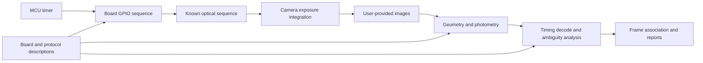

# System Design

Status: initial design, 2026-09-04. Repository boundaries and structure follow this document; coding schemes and performance claims remain subject to future evidence.

## 1. Recommendation and scope

Use one independent repository containing firmware, board profiles, and an offline analysis library with a CLI. UNO R4 WiFi meets the initial single-board, USB-powered, solderless goal. It is a practical optical reference prototype, but current evidence does not establish 100 µs measurement accuracy.

Initially assume a stationary target, fixed cameras, and one physical board visible to all cameras. Multiple nodes mean cameras grouped by acquisition node. Independently running LED boards would introduce separate clock offsets and drift; non-overlapping views need a separate reference-transfer or shared-clock design.

The tool measures actual exposure relationships. Images alone cannot isolate operating-system clock error, transport latency, and camera-internal delay. A node-level result is explicitly an optical offset from representative cameras or a documented aggregation.

## 2. Measurement pipeline



Firmware runs independently of timely host commands. Serial communication may configure, start, stop, and export a run description; USB command arrival does not define exposure ground truth. Record a run ID and treat resets as new segments.

## 3. Firmware and optical encoding

### Timing chain

Start with a GPT periodic event, a short ISR, and precomputed GPIO source/sink operations. Retain Arduino framework startup and upload support; use reviewed FSP or register operations on the critical path. Record timer channel, clock source, divider, period counts, interrupt priority, and blanking duration.

This chain includes interrupt latency; it is not direct hardware-timed GPIO output. DTC/DMAC/event-driven operations are possible future investigations, subject to checking multi-port writes, direction changes, and trigger support. Do not promise arbitrary LED switching without jitter.

Illuminate at most one LED per slot. Disable the previous pair and keep unrelated matrix pins high-impedance before enabling the next pair. The optical model must include actual conduction and blanking windows. Startup, shutdown, and errors are explicitly outside valid measurement operation.

The official 10 kHz driver advances one LED per interrupt, taking approximately 9.6 ms for 96 LEDs. Its framebuffer must not be treated as a simultaneously updated 96-bit time code. See [hardware evidence](hardware/uno-r4-wifi.md).

### Encoding progression

| Stage | Candidate | Deliverable | Limitation |
| --- | --- | --- | --- |
| v0 readability prototype | Fixed 96-LED sweep, initially 250 µs/slot, later 100 µs/slot | Exposure-covered positions, within-cycle phase differences, quality diagnostics | Periods of 24 ms / 9.6 ms cannot distinguish whole-cycle offsets |
| v1 measurement protocol | Precisely specified long-period single-LED sequence, jointly decoded across frames | Shared epoch, frame associations, and complete offsets when identifiable | Exposure integration discards event order; a long period alone does not guarantee identifiability |

v0 outputs must be labeled phase-only or represented as candidate sets. For example, offsets of 0.2 ms and 9.8 ms can have the same phase under a 9.6 ms cycle. A phase match cannot prove absence of whole-frame errors.

Before v1 implementation, define generation rules, seed/state, period, optical start identification, observation requirements, and search bounds. A candidate is a constrained pseudorandom sequence of LED positions with controlled duty cycles. Do not select an unexamined LFSR polynomial during initialization. Establish whether exposure-integrated vectors and multi-frame observations reject competing epochs over the intended operating range. If they do not, revise the protocol rather than guessing in the decoder.

Long exposures can erase phase information when they cover complete repeated cycles. Very short exposures may reveal only one LED without identifying a position within its slot. Initially use fixed exposure and gain, capturing several slots while retaining useful boundary information; choose actual settings from camera metadata and optical readability.

## 4. Offline CV analysis

Use Python 3.11+, NumPy, OpenCV headless, and tqdm. Use standard-library argparse and JSON input descriptions. Users supply images as independent camera sequences or explicitly cropped views of composite images. Do not integrate camera SDKs, device control, or another acquisition repository. Video-container input requires a later explicit request.

Processing stages:

1. Read the input manifest, camera/node membership, ordered frames, exposure information, and board/protocol identifiers.
2. Obtain a complete grid from a separate slow localization sequence. Initially allow explicit corners and orientation; a high-speed image need not show all corners.
3. Sample LED regions using a planar mapping while retaining original sensor coordinates. Significant lens distortion requires existing intrinsic calibration.
4. Estimate background, per-LED response, and noise from dark and slow illumination captures. Extract unsaturated intensities; avoid reducing partial exposures to binary observations.
5. Fit exposure integration to obtain start/midpoint estimates, feasible intervals, or competing candidates. Record residuals, ambiguity, and rejection reasons.
6. Associate frames monotonically using optical time and explicit correspondence constraints. Do not hide whole-frame offsets with unrestricted nearest-time pairing.
7. Stream per-frame results and aggregate camera/node metrics, quality diagnostics, and a report with progress feedback.

Add `io`, `geometry`, `photometry`, `decode`, `metrics`, `report`, and `cli` modules as functionality is implemented. Avoid empty interface layers and speculative plugin discovery. Start with explicit board selection; abstract shared behavior when a second board provides concrete requirements.

## 5. Exposure model

For LED j under global shutter, use the initial model:

```text
I_j = background_j + gain_j * integral(L_j(t), t_start, t_start + exposure) + noise_j
```

The sequence and board conduction windows define `L_j(t)`. Prefer known exposure duration. Joint exposure estimation is permitted only when identifiable, with separate uncertainty reporting. The model assumes unsaturated, calibrated response; ISP processing, gamma, and compression can violate that assumption.

Rolling shutter assigns different exposure start times to different sensor rows. Initially prioritize quantitative global-shutter support. Rolling-shutter inputs may receive diagnostics; corrected quantitative results require known or calibrated line timing and direction:

```text
t_start(y) = t_start(y_ref) + (y - y_ref) * line_time
```

Preserve sensor coordinates, ROI offsets, and reference-row definitions through rotation, cropping, and resizing. Use column coordinates where the sensor scans by column. See [Basler Electronic Shutter Types](https://docs.baslerweb.com/electronic-shutter-types).

## 6. Metrics and decisions

Default to exposure midpoint; exposure-start analysis is an explicit option. For matched frames, `delta_ab = t_b - t_a`; positive values mean B exposes later than A.

- **Offset:** median pairwise delta, retaining every valid frame-level value.
- **Jitter:** sample standard deviation, P95 absolute residual, and peak-to-peak range after subtracting median delta. Report sample counts; insufficient samples do not yield a fabricated standard deviation.
- **Drift:** separately fit delta against optical time. Detrended jitter supplements, rather than replaces, original statistics.
- **Frame consistency:** optical inter-frame intervals, residuals against an explicitly specified expected interval, missing/duplicate/unmatched candidates, and anomalous segments. File indices are not hardware frame counters.
- **Node offset:** report cross-node camera pairs first. Default node summaries use explicitly selected representative cameras. Aggregate only with established camera relationships and a documented method.

Results use `pass`, `fail`, or `inconclusive` when user-supplied criteria exist. Slot duration is not an acceptance threshold. Decisions require adequate coverage, observation span, and uncertainty. Periodic ambiguity or unknown rolling-shutter timing cannot yield a pass.

Frame pairing must preserve both user-supplied capture groups and algorithm-inferred associations. A supplied group is a synchronization claim to measure, not proof of simultaneous exposure. Do not optimize away the offsets being evaluated.

## 7. Accuracy evidence and milestones

Retain MCU ticks and nominal microsecond conversion. Mark uncalibrated clock scales explicitly. Timer period, ISR latency, optical conduction, image response, and decoding error are distinct error sources. Internal MCU timing or agreement between cameras alone does not establish externally traceable absolute accuracy.

Routine use requires no oscilloscope or photodiode. A later claim of calibrated absolute accuracy may require separate external calibration. Without it, describe an uncalibrated prototype and observed repeatability. Future validation activities below require the user's explicit authorization under project conventions.

| Milestone | Deliverable | Evidence needed to proceed |
| --- | --- | --- |
| M0: initialization | Design, conventions, layout, configuration scaffolding | Traceable documentation and explicit implementation status |
| M1 | Slow localization, 250 µs single-LED sweep, run description | Actual images resolve LEDs; GPIO and duty cycles are reviewed |
| M2 | Manual geometry, photometry, v0 phase decoding | Real-image results have interpretable intervals and rejection reasons |
| M3 | Frozen v1 protocol, epoch decoding, multi-camera CLI and reports | Whole-cycle/frame ambiguity is resolved under stated conditions |
| M4 | 100 µs mode, rolling-shutter support, performance improvements | Coverage and error evidence for supported cameras and exposures |

The first image source is Arducam B0267 with four monochrome global-shutter OV9281 sensors. Existing records include 5120 × 800 composite frames and a measured mode around 44.972 fps. See [B0267 input notes](hardware/arducam-b0267-input.md). Actual exposure, target image size, frame correspondence, and shared visibility still depend on the supplied dataset.
